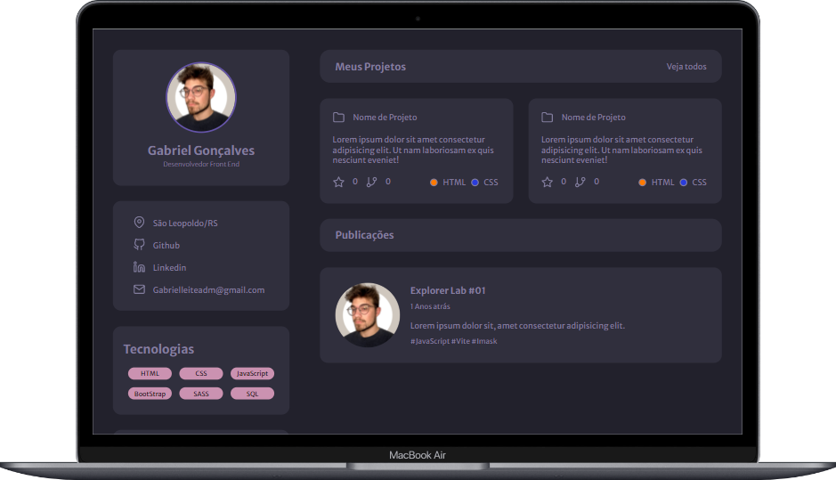
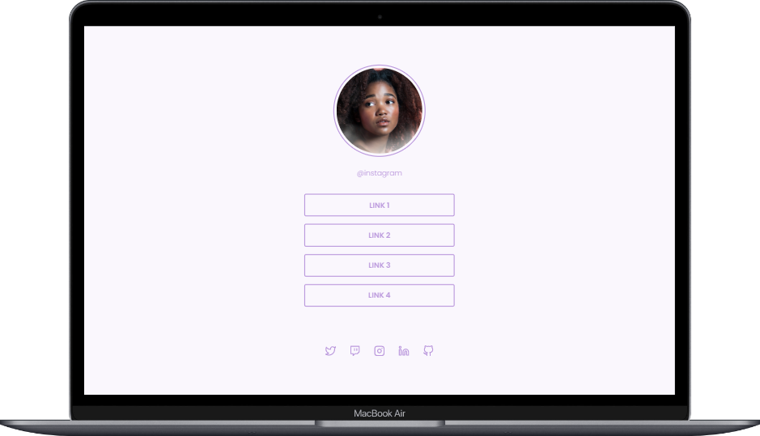
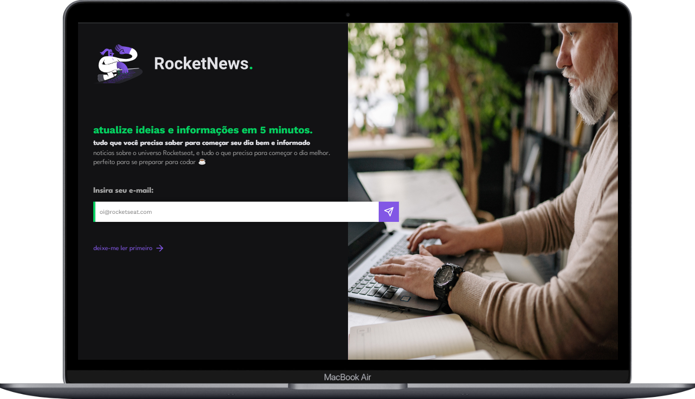
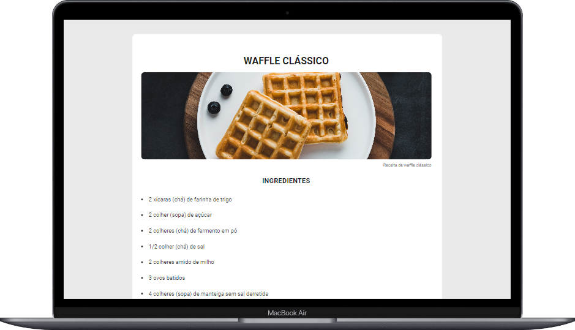

<h1 align="center">
  Desafios Rocketseat 🚀
</h1>

  <a href="#-desafios">Desafios</a>&nbsp;&nbsp;&nbsp;|&nbsp;&nbsp;&nbsp;
  <a href="#-licença">Licença</a>&nbsp;&nbsp;&nbsp;|&nbsp;&nbsp;&nbsp;
  <a href="#-contato">Contato</a>

 

## 💣 Desafios

Aqui você pode conferir os desafios em suas respectivas versões categorizados pela dificuldade. 
## Dificuldades
 

  
  

 

  <a href="#-iniciante">😀 Iniciante</a>    

  <a href="#-intermediário">😐 Intermediário</a>  

  <a href="#-avançado">😡 Avançado</a>  
  

 

## 😀 Iniciante

 

## Desafio 01 - Portfolio.

 

[👉 Link para visualizar o desafio 01.](https://gabrielfleckl.github.io/desafios-rocketseat/Portfolio/)

 
   

 

## 🚀 Tecnologias

Esse desafio foi desenvolvido com as seguintes tecnologias:

 
 
 

---

## Desafio 02 - Link tree.

 

[👉 Link para visualizar o desafio 02.](https://gabrielfleckl.github.io/desafios-rocketseat/Social-tree/)

 
   

 

## 🚀 Tecnologias

Esse desafio foi desenvolvido com as seguintes tecnologias:

 
 
 

---

## Desafio 03 - RocketNews.

 

[👉 Link para visualizar o desafio 03.](https://gabrielfleckl.github.io/desafios-rocketseat/RocketNews/)

 
   

 

## 🚀 Tecnologias

Esse desafio foi desenvolvido com as seguintes tecnologias:

 
 
 
 

---

## Desafio 04 - Página de Receitas.

 

[👉 Link para visualizar o desafio 04.](https://gabrielfleckl.github.io/desafios-rocketseat/Pagina-de-receitas/)

 
   

 

## 🚀 Tecnologias

Esse desafio foi desenvolvido com as seguintes tecnologias:

 
 
 

---

 

## 😐 Intermediário

 

## 📝 Licença

Esse projeto está sob a licença MIT. Veja o arquivo [LICENSE](LICENSE) para mais detalhes.

 

## 🌐 Contato

 

---

Feito com ♥ by Gabriel Gonçalves 🖖 &nbsp;&nbsp;&nbsp;|&nbsp;&nbsp; <a href="#--desafios-rocketseat-">Voltar para o Inicio ⬆️ </a>
 
